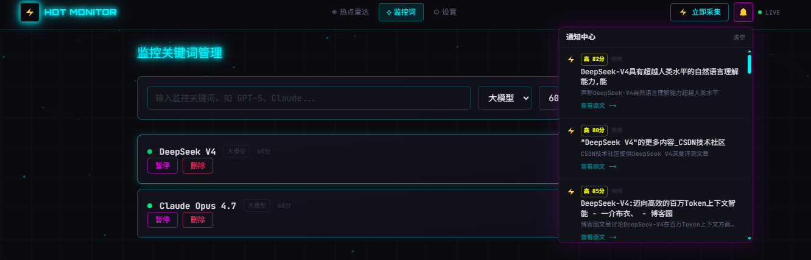
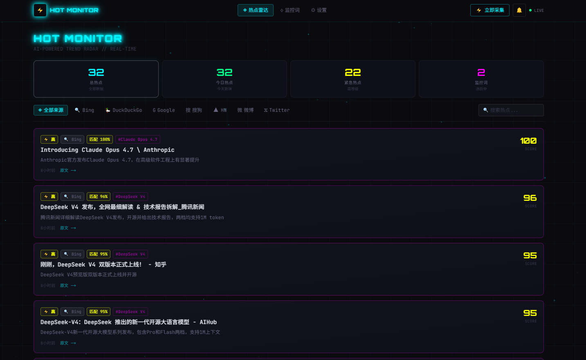

# AI 热点监控系统

一个由 AI 驱动的实时热点监控工具，帮助你第一时间发现 AI 领域的重大更新和热点事件。
 




## 功能特性

- **多源聚合**：同时从 Bing、DuckDuckGo、Google、搜狗、HackerNews、微博、Twitter 7 个信息源采集数据
- **AI 智能分析**：通过 OpenRouter 接入 AI 模型，自动识别热点真伪、评分（0-100）、生成中文摘要
- **热点等级**：自动划分低 / 中 / 高三个等级，高等级（≥80分）为紧急热点
- **实时推送**：采集到高分热点后通过 WebSocket 立即推送到浏览器通知面板
- **多维筛选**：支持按时间（今日/全部）、等级（紧急）、监控词、来源标签、关键词搜索组合过滤
- **定时采集**：每 60 分钟自动采集一次，也可手动触发
- **邮件通知**：可选配置 SMTP 邮件通知

## 技术栈

| 层级 | 技术 |
|------|------|
| 框架 | Next.js 15 (App Router) |
| 样式 | Tailwind CSS v4，赛博朋克主题 |
| 数据库 | sql.js（SQLite，纯 JS 实现） |
| 实时通信 | Socket.IO |
| AI | OpenRouter（支持任意模型） |
| 定时任务 | node-cron |
| HTML 解析 | cheerio |

## 快速开始

### 1. 安装依赖

```bash
npm install
```

### 2. 配置环境变量

复制 `.env.example` 为 `.env.local` 并填入配置：

```bash
cp .env.example .env.local
```

```env
# OpenRouter AI（必填）
OPENROUTER_API_KEY=sk-or-your-key-here
OPENROUTER_MODEL=anthropic/claude-sonnet-4-6

# Twitter/X（可选，填入后启用 Twitter 数据源）
TWITTER_API_KEY=your-twitterapi-io-key

# 邮件通知（可选）
SMTP_HOST=smtp.gmail.com
SMTP_PORT=587
SMTP_USER=your@email.com
SMTP_PASS=your-password
NOTIFY_EMAIL=notify@email.com
```

### 3. 启动项目

```bash
npm run dev
```

访问 [http://localhost:3000](http://localhost:3000)

## 使用说明

### 添加监控关键词

进入「监控词」页面，输入关键词（如 `GPT-5`、`Claude`、`Cursor`），选择分类和检查间隔，点击添加。

### 采集热点

- **手动采集**：点击导航栏右侧「⚡ 立即采集」按钮
- **自动采集**：系统每 60 分钟自动运行一次

### 查看热点

首页支持多维度筛选：
- 上方卡片：按总热点 / 今日热点 / 紧急热点 / 监控词切换
- 来源标签：按信息来源筛选
- 搜索框：关键词全文搜索

### 通知

点击导航栏右侧 🔔 图标查看通知面板，采集到高分热点时会实时弹出通知。

## 项目结构

```
src/
├── app/                    # Next.js 页面和 API
│   ├── page.tsx            # 热点雷达首页
│   ├── keywords/           # 监控词管理
│   ├── settings/           # 通知设置
│   └── api/                # API 路由
├── lib/
│   ├── db/                 # SQLite 数据层
│   ├── sources/            # 数据源（8个）
│   │   ├── bing.ts
│   │   ├── duckduckgo.ts
│   │   ├── google.ts
│   │   ├── sogou.ts
│   │   ├── hackernews.ts
│   │   ├── weibo.ts
│   │   ├── twitter.ts
│   │   └── aggregator.ts
│   ├── ai/                 # OpenRouter AI 分析
│   ├── notifications/      # Socket.IO + 邮件
│   └── scheduler/          # 定时任务
├── components/             # 赛博朋克 UI 组件
└── types/                  # TypeScript 类型定义
server.ts                   # 自定义服务器（Next.js + Socket.IO）
docs/                       # 需求文档和技术方案
```

## 数据来源说明

| 来源 | 类型 | 说明 |
|------|------|------|
| Bing | 搜索引擎 | 国内可用，主力来源 |
| DuckDuckGo | 搜索引擎 | 国内可能超时，自动降级 |
| Google | 搜索引擎 | 需代理，自动降级 |
| 搜狗 | 搜索引擎 | 国内可用 |
| HackerNews | 技术社区 | 官方 Algolia API，免费无需 key |
| 微博 | 社交媒体 | 热搜榜 + 关键词搜索 |
| Twitter/X | 社交媒体 | 需配置 `TWITTER_API_KEY` |

## 开发文档

- [需求文档](docs/requirements.md)
- [技术方案](docs/technical-design.md)
